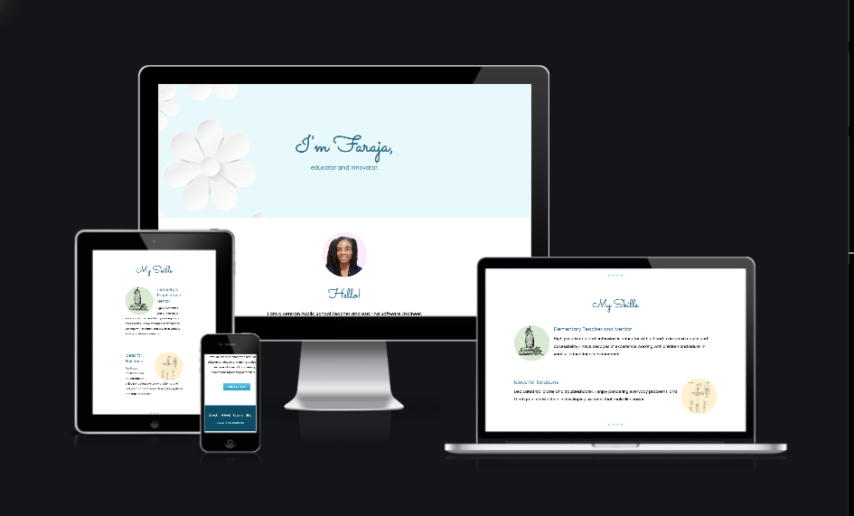
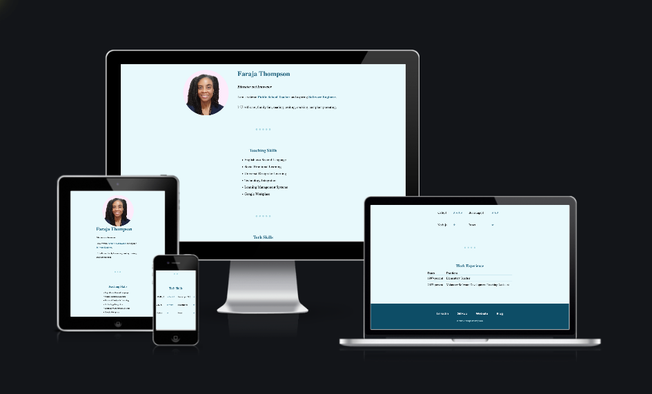

# Personal Website HTML + CSS Project

The Complete 2022 Web Development Bootcamp, Sections 2-5: Introductory and Intermediate HTML and CSS - Dr. Angela Yu

Here is my completed personal website (and resume) project.  Some of my progress and discoveries are noted in the commit comments.

I decided to go the extra mile and use what I have learned so far about HTML and CSS to make sure that my website passed the W3C Markup Validation, the WAVE Web Accessibility Tool, and I did several checks for responsiveness.

## Table of contents

- [Overview](#overview)
  - [Screenshots](#screenshots)
  - [Links](#links)
- [My process](#my-process)
  - [Built with](#built-with)
  - [What I learned](#what-i-learned)
  - [Continued development](#continued-development)
  - [Useful resources](#useful-resources)
- [Author](#author)
- [Acknowledgments](#acknowledgments) 

## Overview

This project involved building a stylized personal site inspired by the works of [Sean Halpin](https://web.archive.org/web/20180819202235js_/http://seanhalpin.io/) and [Pascal van Gemert](http://www.pascalvangemert.nl/#/experiences).  I started out creating a very rudimentary website using mostly HTML, then I opened a new index file, and strengthened my knowledge of using CSS in order to style a structure created with HTML.  Some of my key take-aways from the HTML and CSS units:
- HTML best practices
- HTML forms
- CSS best practices
- How to use CSS static, relative, and absolute positioning systems
- Centering elements using CSS
- How to use CSS float and clear

### Screenshots
#### Mobile and Desktop Views

| <b>Personal Website</b> | 
|:--:|
|  |
| [Direct Link to My Personal Website on Am I Responsive Website](https://ui.dev/amiresponsive?url=https://web.archive.org/web/20220508014514/https://faraja17.github.io/my-website/)|

| <b>Resume</b> | 
|:--:|
|  |
| [Direct Link to My Resume on Am I Responsive Website](https://ui.dev/amiresponsive?url=https://web.archive.org/web/20220508014819/https://faraja17.github.io/my-website/resume.html)|

| <b>More Screenshots</b> | 
|:--:|
|  |
| [Direct Link to Google Presentation](https://docs.google.com/presentation/d/e/2PACX-1vROkxVyUGrL-H86BwdRjp2-pR0OU4mqIA1PmLdf0vh8ypV4msyidQBM9mZgJLeFc7AsDSrrOJjhP8Oe/pub?start=false&loop=false&delayms=3000&slide=id.g1270c083a6c_0_146)|

### Links

- Live Site URLs: [Personal Website | ](https://web.archive.org/web/20220508014514/https://faraja17.github.io/my-website/)
                  [Resume](https://web.archive.org/web/20220508014819/https://faraja17.github.io/my-website/resume.html)
- Live on Am I Responsive: [Personal Website |](https://ui.dev/amiresponsive?url=https://web.archive.org/web/20220508014514/https://faraja17.github.io/my-website/)
                           [Resume](https://ui.dev/amiresponsive?url=https://web.archive.org/web/20220508014819/https://faraja17.github.io/my-website/resume.html)

## My process

I started out reviewing how to structure a website in HTML.  I created and linked an index page and two additional pages named: Contact Me and Hobbies.  On the Contact Me page, I had a lot of practice creating forms.  During the Intermediate CSS unit, I set up a new index file and created and styled a one page website.  

At the end of the unit, I decided to extend my practice by using what I had learned about validity, accessibility, and responsiveness in a University of Michigan course on Coursera, Web Design for Everybody: Basics of Web Development & Coding.  I decided to incorporate the code of the rudimentary HTML index page as the resume.html linked to my new index file.  I added a bit of matching styling and also put it through the tests for validity, accessibility, and responsiveness.

I used some old tricks I already knew to create my background image and the other illustrations.  I found all of the images through creative commons websites, I removed the backgrounds and added my own colors using [Remove.bg](https://remove.bg), Google Slides, and my computer's screenshot tool.  I did learn [how to crop the images into circular shapes](https://crop-circle.imageonline.co/) from Dr. Yu. It took a lot of trial and error to decide upon appropriate images, especially the bacground image.  I was going for a subtle embossed look, and I think that this [paper flower background](https://pixabay.com/illustrations/paper-flower-background-white-4794429/) is perfect.  It is bold and muted at the same time, a very elegant statement piece.  

It was somewhat difficult to let go of the color scheme that I started out with, but it wasn't accessible, so it had to go.  I ultimately decided upon more contrasting font colors and a darker background for my footer, all still within the original turquoise color family.

### Built with

- Semantic HTML5 markup
- CSS 3 properties

### What I learned

Through this practice, I had a thorough review of how to create forms.  I appreciate how Dr. Yu encourages frequent consulting of the documentation on sites such as [MDN](https://developer.mozilla.org/en-US/),  [W3Schools](https://www.w3schools.com/), and [DevDocs](https://devdocs.io/).  I learned how important it is to be comfortable navigating these and other documentation sites often while coding to learn methods, standards, and best practices.

I had some epiphany moments while styling my site.  I suddenly realized that `margin: 0 auto;` is not the magical centering spell that I had imagined it to be.  I gained a clear understanding that the zero represents the top and bottom margins and can actually be changed to another number without affecting the centering, and that the real magic happens through the `auto`, which controls the left and right margins and does the centering work.  

Another example of insight gained was about how browser defaults can completely throw off my code, and how the inspect browser tool can help to troubleshoot and debug because I can use it to visually determine the effects of the properties I have implemented and to identify any pesky defaults.  I was also introduced to the Pesticide for Chrome extension, which outlines each element to better see placement on the page.

I learned a lot about selecting color scheme.  As I mentioned, I got attached to the colors that I had originally chosen.  But as I worked to make my site accessible, I realized that font colors need to contrast well.  Just as images conveying meaning must be carefully selected and labeled with either alt-text or aria, any text that conveys meaning must be styled with readability and accessibility in mind.  I quickly got used to the new color scheme, and I was happy to keep the original lighter colors in the borders and other accents.

Overall, I gained much better control of positioning and design through my work on this project.

>*A side note:* I also learned much more about Markdown through writing this README page, especially for the Screenshots section.  I reviewed [how to set up a table](https://towardsdev.com/3-ways-to-add-a-caption-to-an-image-using-markdown-f2ca30562be6) and how to create links.  Through additional research, learned [how to simulate an embedded video](https://github.com/martinsolent/video-iframe).  I used this information to simulate an embedded Google Slide show, once I realized that I would not be able to use iframe code. It took a lot of trial and error to get the code right, but I finally did it!

### Continued development

After finishing this project, I successfully completed an [HTML/CSS challenge](https://github.com/Faraja17/qr-challenge) from Frontend Mentor.  I am excited to complete additional Frontend Mentor challenges as I learn more Javascript and Python.

I feel that I can now create some websites for friends and family members.  I have already begun learning Bootstrap, and I would probably use that heavily to streamline the process.  I am sure that eventually, as I learn more Bootstrap and JavaScript, I will want to revise this website, but I feel that it is perfect for now.  I am very pleased to have learned today how to archive my website and resume through the [Wayback Machine Save Page Now feature](https://web.archive.org/), so that I can always revisit how my first successful website has evolved as time has passed.

### Useful resources

- [Pesticide Extension](https://chrome.google.com/webstore/detail/pesticide-for-chrome/bakpbgckdnepkmkeaiomhmfcnejndkbi/related) - This extension inserts the Pesticide CSS into the current page, outlining each element to better see placement on the page.
- [Humans.fyi](https://humans.fyi/u/seanhalpin.io) - Sean Halpin's work featured on Humans.fyi, ". . .an inspiration gallery showcasing how personal websites look today."
- [One Page Love](https://onepagelove.com/pascal-van-gemert) - Pascal Van Gemert's work featured on OnePageLove.com, ". . .the leading showcase of beautiful One Page websites, templates and resources."

## Author

Faraja Thompson
- [My Current Personal Website](https://faraja17.github.io/my-website/)
- [My Blog: Teacher to Techie](https://faraja17.github.io/)
- [Faraja Thompson, M.Ed. on LinkedIn](https://www.linkedin.com/in/faraja-thompson-m-ed-70885b8/)

## Acknowledgments

I'd like to acknowledge my son and mentor [DeForestt Thompson](https://github.com/DeForestt).  His steadfast support and encouragement keep me motivated!  Thanks for forcing me to use the command-line, Son <3 <3 <3.
